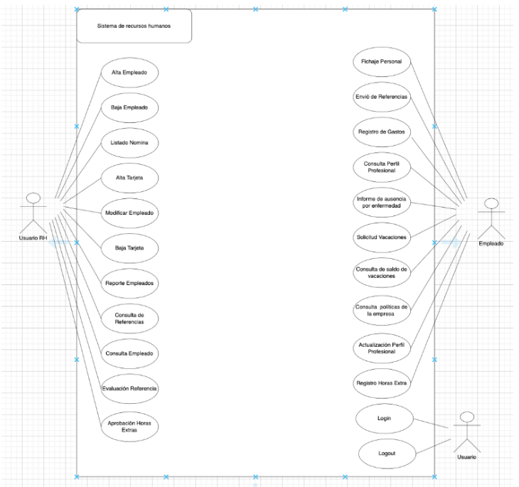
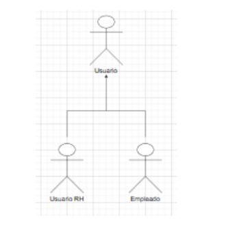
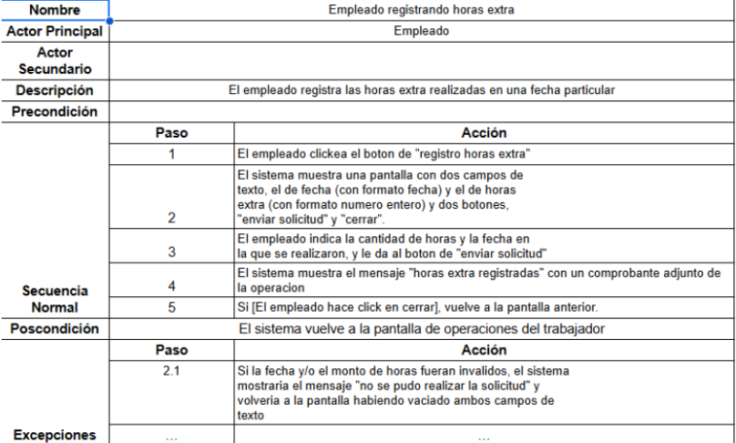
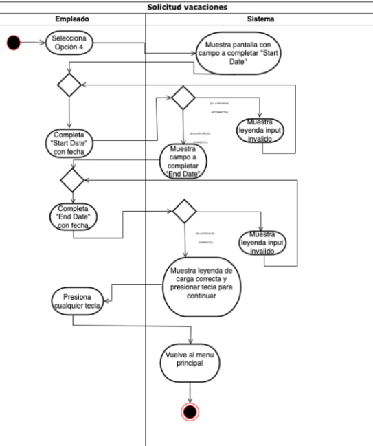
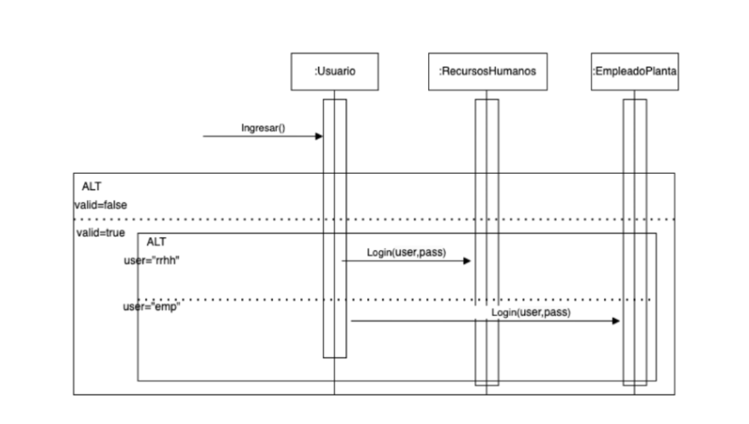

# Documentacion de la APP DE RRHH: 

Este proyecto contiene la siguiente documentación:
## Contenido
- Diagramas de casos de uso
- Diagramas de clases
- Diagramas de actividades
- Diagramas de secuencia
- Interfaces de usuario (prototipado)

## Tecnologías y herramientas
- UML
- Herramienta de diseño (draw.io)
  

## Alcance del Sistema de Recursos Humanos 
El sistema debe permitir iniciar sesión y cerrar sesión al usuario.  
El sistema debe gestionar la alta, baja, modificación y consulta de empleados, así como la gestión de tarjetas de los mismos. También deberá generar reportes de 
empleados y aprobar horas extras cuando sea necesario. Además, debe permitir la consulta y evaluación de referencias laborales, así como también deberá mostrar el 
listado de nómina.  El sistema debe permitir el registro de su asistencia personal, el envío de referencias laborales y el registro de gastos relacionados con su trabajo. También deberá generar informes de ausencias por enfermedad y permitir la consulta del saldo de días de vacaciones disponibles. Además, los empleados podrán actualizar 
su perfil profesional y así como solicitar días de vacaciones.  El sistema es un sistema de gestión y administración de los empleados de la empresa, no es un sistema 
de reclutamiento tampoco podrá generar los recibos de sueldos. No se ocupará de liquidaciones de sueldo ni cálculos de retenciones o impuestos. 

## Diagrama de clases 

## Diagrama de casos de usos

### El diagrama presentado es un diagrama de casos de uso que muestra las interacciones entre los usuarios y el sistema de recursos humanos. 
Actores:
Usuario RH (Recursos Humanos): Es el administrador del sistema de recursos humanos que tiene permisos para realizar acciones administrativas y de gestión de empleados.
Empleado: Es el usuario común del sistema que tiene permisos para realizar ciertas consultas y solicitudes relacionadas con su perfil y actividades laborales.
Usuario: Representa a cualquier usuario del sistema, tiene permisos limitados a funciones básicas como login y logout.

Casos de Uso para Usuario RH:
    Alta Empleado: Permite dar de alta a un nuevo empleado en el sistema.
    Baja Empleado: Permite dar de baja a un empleado existente en el sistema.
    Listado Nómina: Permite consultar la nómina de los empleados.
    Alta Tarjeta: Permite registrar una nueva tarjeta (posiblemente de acceso o identificación) para un empleado.
    Modificar Empleado: Permite actualizar la información de un empleado.
    Baja Tarjeta: Permite dar de baja una tarjeta registrada.
    Reporte Empleados:  Permite generar reportes relacionados con los empleados.
    Consulta de Referencias: Permite consultar las referencias de un empleado.
    Consulta Empleado: Permite consultar la información detallada de un empleado.
    Evaluación Referencia: Permite evaluar las referencias de un empleado.
    Aprobación Horas Extras: Permite aprobar las horas extras registradas por los empleados.

Casos de Uso para Empleado:
    Fichaje Personal: Permite al empleado realizar su fichaje personal, posiblemente registrar su entrada y salida del trabajo.
    Envío de Referencias: Permite al empleado enviar referencias laborales.
    Registro de Gastos: Permite al empleado registrar sus gastos relacionados con el trabajo.
    Consulta Perfil Profesional: Permite al empleado consultar su perfil profesional.
    Informe de Ausencia por Enfermedad: Permite al empleado reportar su ausencia por motivos de enfermedad.
    Solicitud Vacaciones: Permite al empleado solicitar vacaciones.
    Consulta de Saldos de Vacaciones: Permite al empleado consultar su saldo de vacaciones disponibles.
    Consulta Políticas de la Empresa: Permite al empleado consultar las políticas de la empresa.
    Actualización Perfil Profesional: Permite al empleado actualizar su perfil profesional.
    Registro Horas Extra: Permite al empleado registrar las horas extras trabajadas.
    
Casos de Uso para Usuario:
    Login: Permite al usuario iniciar sesión en el sistema.
    Logout: Permite al usuario cerrar sesión en el sistema.

#### Descripción General:
El diagrama de casos de uso proporciona una visión clara de las funcionalidades del sistema de recursos humanos y cómo interactúan los diferentes tipos de usuarios con estas funcionalidades. El usuario de recursos humanos tiene acceso a una amplia gama de casos de uso relacionados con la gestión y administración de empleados, mientras que los empleados pueden realizar acciones relacionadas con su propio perfil y actividades laborales. Además, todos los usuarios tienen la capacidad de iniciar y cerrar sesión en el sistema.
Este diagrama es útil para entender los requisitos funcionales del sistema y cómo se distribuyen las responsabilidades entre los distintos tipos de usuarios, asegurando así que todas las funciones necesarias estén cubiertas y que los usuarios tengan acceso a las herramientas adecuadas según sus roles.

## Narrativas de casos de uso 

-El resto de las narrativas -> Ver en carpteta /narrativas_casos_de_uso

## Diagrama de actividades 

-El resto de los diagramas de actividades -> Ver en carpteta /diagramas_actividades

## Diagrama de secuencia 

-El resto de los diagramas de secuencia -> Ver en carpteta /diagramas_secuencia

## Prototipo de interfaz 

-El resto de los diagramas de secuencia -> Ver en carpteta /diagramas_interfaz

