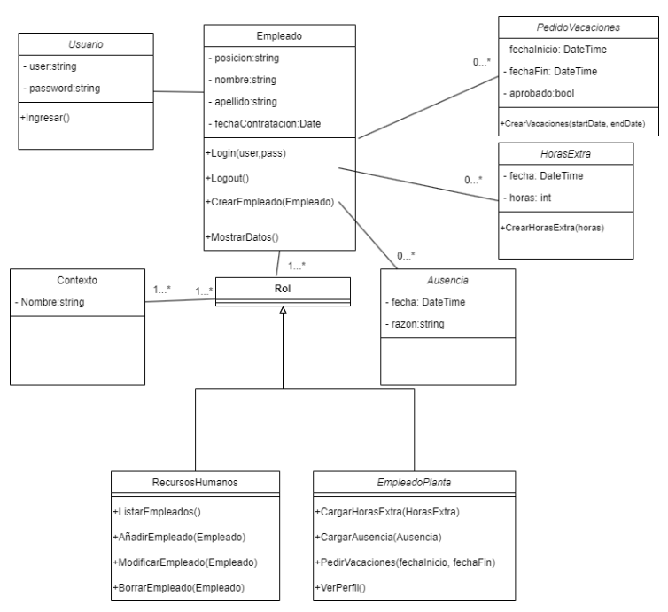

# Documentacion de la APP DE RRHH: 

Este proyecto contiene la siguiente documentación:
## Contenido
- Diagramas de casos de uso
- Diagramas de clases
- Diagramas de actividades
- Diagramas de secuencia
- Interfaces de usuario (prototipado)

## Tecnologías y herramientas
- UML
- Herramienta de diseño (draw.io)
  

## Alcance del Sistema de Recursos Humanos 
El sistema debe permitir iniciar sesión y cerrar sesión al usuario.  
El sistema debe gestionar la alta, baja, modificación y consulta de empleados, así como la gestión de tarjetas de los mismos. También deberá generar reportes de 
empleados y aprobar horas extras cuando sea necesario. Además, debe permitir la consulta y evaluación de referencias laborales, así como también deberá mostrar el 
listado de nómina.  El sistema debe permitir el registro de su asistencia personal, el envío de referencias laborales y el registro de gastos relacionados con su trabajo. También deberá generar informes de ausencias por enfermedad y permitir la consulta del saldo de días de vacaciones disponibles. Además, los empleados podrán actualizar 
su perfil profesional y así como solicitar días de vacaciones.  El sistema es un sistema de gestión y administración de los empleados de la empresa, no es un sistema 
de reclutamiento tampoco podrá generar los recibos de sueldos. No se ocupará de liquidaciones de sueldo ni cálculos de retenciones o impuestos. 

## Diagrama de clases 

## Diagrama de casos de usos

## Narrativas de casos de uso 
-El resto de las narrativas -> Ver en carpteta /narrativas_casos_de_uso

## Diagrama de actividades 
-El resto de los diagramas de actividades -> Ver en carpteta /diagramas_actividades

## Diagrama de secuencia 

-El resto de los diagramas de secuencia -> Ver en carpteta /diagramas_secuencia

## Prototipo de interfaz 

-El resto de los diagramas de secuencia -> Ver en carpteta /diagramas_interfaz

